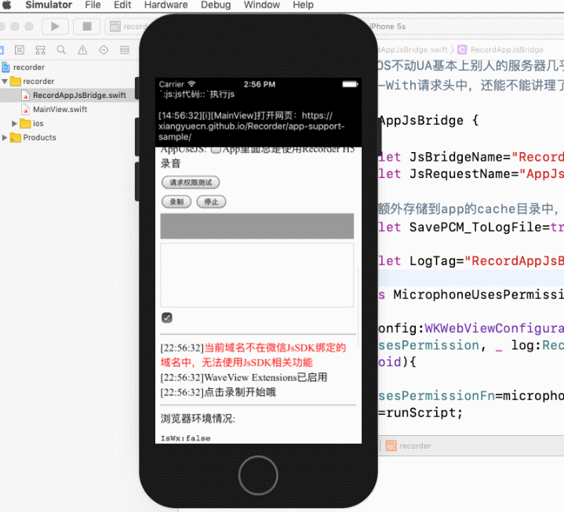

[Recorder](https://github.com/xiangyuecn/Recorder/) | [RecordApp](https://github.com/xiangyuecn/Recorder/tree/master/app-support-sample)

# :open_book:IOS Hybrid App

本目录内包含IOS App测试源码，和核心文件 [RecordAppJsBridge.swift](https://github.com/xiangyuecn/Recorder/blob/master/app-support-sample/demo_ios/recorder/RecordAppJsBridge.swift) ；clone后用`xcode`打开后编译运行（没有Mac OS? [装个黑苹果](https://www.jianshu.com/p/cbde4ec9f742) ）。本demo为swift代码，兼容IOS 9.0+，已测试IOS 12.3。

本Demo是对[/app-support-sample/native-config.js](https://github.com/xiangyuecn/Recorder/blob/master/app-support-sample/native-config.js)配置示例中定义的JsBridge接口的实现。

可以直接copy目录内`RecordAppJsBridge.swift`使用，此文件为核心文件，其他文件都是没什么价值的；支持新开发WKWebView界面，或对已有的WKWebView实例升级支持RecordApp。

**xcode测试项目clone后请修改`PRODUCT_BUNDLE_IDENTIFIER`，不然这个测试id被抢来抢去要闲置7天才能被使用，嫌弃苹果公司工程师水准**

## 【截图】

## 【限制】

- 未做古董版本UIWebView适配，理论上并不需要太大改动就能支持，并不打算进行支持
- 未测试在OC中调用此swift文件，并不打算去写OC代码（学不动）

# :open_book:原理

通过userContentController往WKWebView注入一个全局对象`RecordAppJsBridgeIsSet`，js中通过`webkit.messageHandlers.RecordAppJsBridgeIsSet`来访问，只有存在这个对象，就代表是在App中；但并不通过这个对象来进行数据交互，因为它仅支持异步操作；数据交互需要一个同步方法来进行支持，因为同步可以实现异步，仅支持异步的只能异步到底，所以选择重写WebView的prompt弹框方法，进行数据的交互。

## 数据交互
swift收到js发起的prompt弹框请求，解析弹框携带的数据参数，并调用参数中接口对应的swift方法，同步执行完后把数据返回给prompt弹框，如果方法是异步的，将在异步操作完成后swift将调用网页的js方法`AppJsBridgeRequest.Call`将数据异步返回（如果是跨域的iframe中发起的异步调用，数据将会使用postMessage来转发返回）。

## 录音接口
接口对应的方法使用的`AVAudioRecorder`来录音，`AVAudioRecorder`会把录音PCM数据写入到文件，因此我们实时从这个文件中读取出数据，然后定时调用`AppJsBridgeRequest.Record`把数据返回给js端即可完成完整的录音功能。

可能是因为`AVAudioRecorder`存在文件写入缓存的原因，数据并非实时的flush到文件的，因此实时发送给js的数据存在300ms左右的滞后；`AudioQueue`、`AudioUnit`之类的更强大的工具文章又少，代码又多，本质上是因为不会用，所以就成这样了。

## 需要权限
在plist中配置麦克风的权限声明：`NSMicrophoneUsageDescription`。

## 如何接入使用
请阅读[RecordAppJsBridge.swift](https://github.com/xiangyuecn/Recorder/blob/master/app-support-sample/demo_ios/recorder/RecordAppJsBridge.swift)文件开头的注释文档，可直接copy此文件到你的项目中使用；支持新开发WKWebView界面，或对已有的WKWebView实例升级支持RecordApp。

## 为什么不用UserAgent来识别App环境

通过修改WebView的UA来让H5、服务器判断是不是在App里面运行的，此方法非常简单而且实用。但有一个致命缺陷，当UA数据很敏感的场景下，虽然方便了我方H5、服务器来识别这个App，但也同时也暴露给了任何在此WebView中发起的请求，不可避免的会将我们的标识信息随请求而发送给第三方（虽然可通过额外编程把信息抹掉，但代价太大了）。IOS不动UA基本上别人的服务器几乎不太可能识别出我们的App，Android神一样的把包名添加到了X-Requested-With请求头中，还能不能讲理了。

